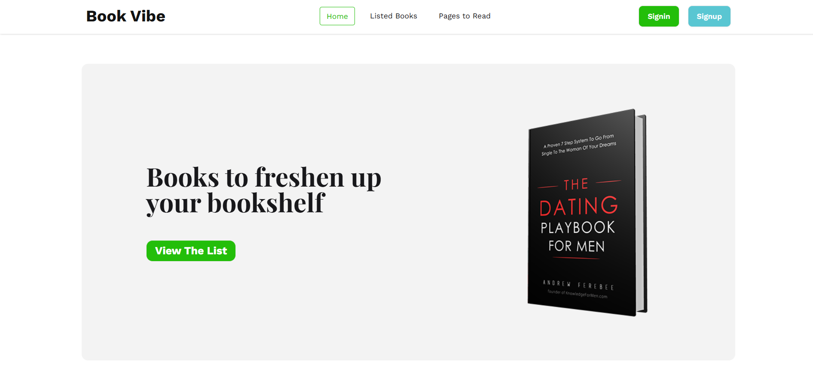
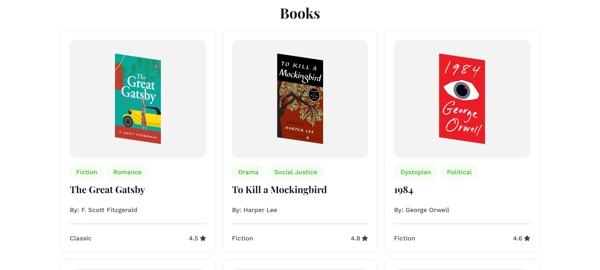
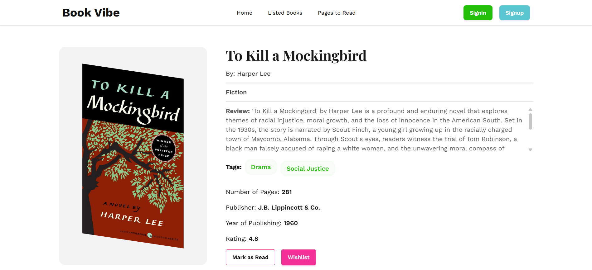
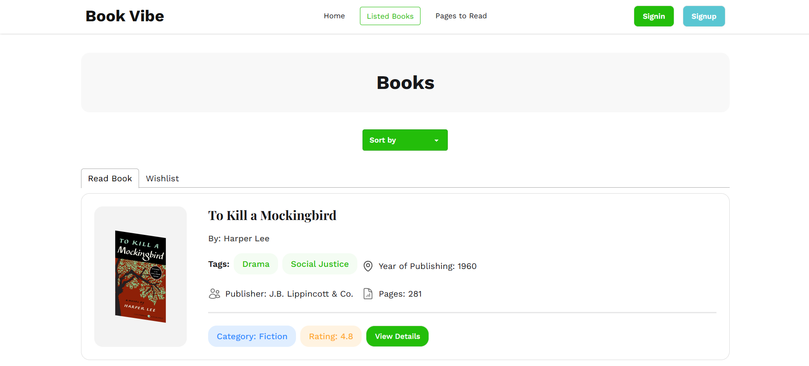
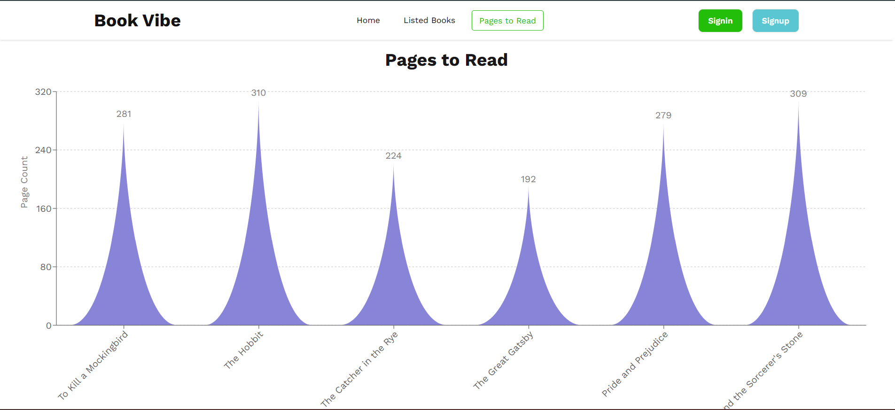

# 📚 Book Worm

**Book Worm** is a sleek, responsive web application designed for book enthusiasts to discover, track, and manage their reading lists. Built with modern web technologies, it offers a seamless experience for exploring literature and keeping tabs on your favorite reads.

🔗 **[Live Demo](https://book-worm.pages.dev/)**

---

## 🚀 Features

* **Book Discovery**: Browse through a curated collection of books with detailed information.
* **Reading Lists**: Add books to your "Wishlist" or "Read" list to keep your library organized.
* **Detailed Insights**: View comprehensive details for each book, including ratings, categories, and descriptions.
* **Dynamic Sorting**: Easily sort books based on publication year or rating to find exactly what you're looking for.
* **Responsive Design**: Fully optimized for desktops, tablets, and mobile devices.
* **Interactive UI**: Smooth transitions and an intuitive user interface powered by React.

---

## 🛠️ Tech Stack

* **Frontend**: React.js
* **Build Tool**: Vite
* **Styling**: Tailwind CSS & DaisyUI
* **Routing**: React Router DOM
* **Icons**: React Icons
* **Deployment**: Cloudflare Pages

---

## 📦 Installation & Setup

To run this project locally, follow these steps:

1.  **Clone the repository:**
    ```bash
    git clone https://github.com/chandan-d-karmaker/book-worm.git
    ```

2.  **Navigate to the project directory:**
    ```bash
    cd book-worm
    ```

3.  **Install dependencies:**
    ```bash
    npm install
    ```

4.  **Start the development server:**
    ```bash
    npm run dev
    ```

5.  **Open in browser:**
    The app will be running at `http://localhost:5173`.

---

## 📂 Project Structure

```text
src/
├── assets/        # Images and global styles
├── components/    # Reusable UI components
├── pages/         # Main page views
|   └── Root.jsx   # Main application component
├── routes/        # Routing configuration
```
## Preview
<div>








</div>

## 🤝 Contributing
Contributions are welcome! If you have suggestions for new features or find any bugs, feel free to open an issue or submit a pull request.

1.  Fork the Project

2. Create your Feature Branch (git checkout -b feature/AmazingFeature)

3. Commit your Changes (git commit -m 'Add some AmazingFeature')

4. Push to the Branch (git push origin feature/AmazingFeature)

5. Open a Pull Request

## 📄 License
This project is open-source and available under the MIT License.

**Developed by Chandan Karmaker**